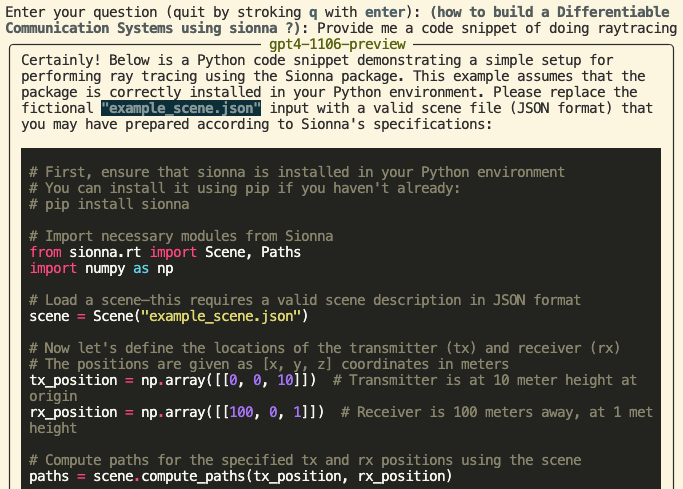

Still under active construction


## Quick Start

### Install required packages
This repo primarily depends on litellm, chromadb to create an Retrieval-Augmented Generation (RAG) system for [sionna](https://nvlabs.github.io/sionna/). You shall start by installing the required packages following the command.
```
pip3 install -r requirements.txt
```

### Create `.env`
Create a `.env` under the repo root dir with the content as follows. Replace `<YOUR-API-KEY>` with your own `api_key`.
```
base_url=https://drchat.xyz
api_key=<YOUR-API-KEY>
embedding_model=text-embedding-3-small
llm=gpt4-1106-preview
vectordb=sionna_db
evaluator=gpt4-32k
cohere_key=<YOUR-COHERE-KEY>
reranker=rerank-english-v3.0
```

### Run example code
Now you can start by running the following command. It provides an demo interface for you to typing questions.
```bash
bash run.sh
```


You may look into the bash script and see how it works. Batch mode is also supported for experiment acceleration.
